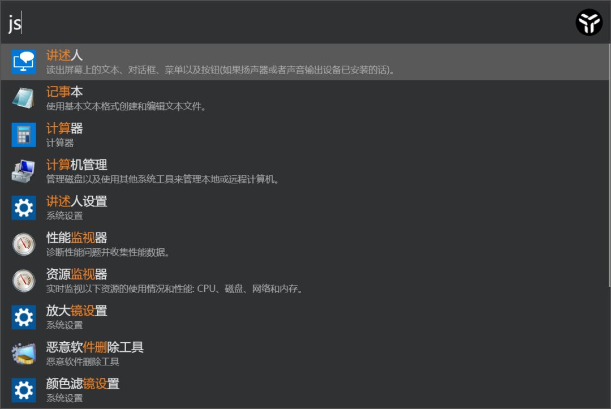
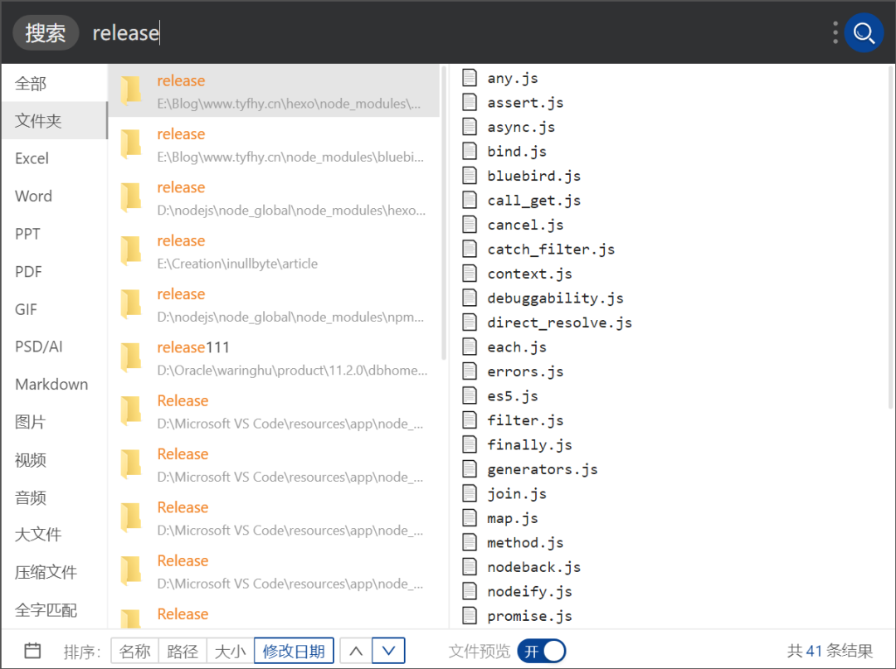

[uTools](https://www.u.tools/) 是一款生产力工具集软件，uTools 在具有了其他工具集软件的「跨平台」、「插件化」等优势之后，依然能保持极简，这是很不容易的。

使用 uTools 我们只需要记住快捷键「Alt + Space」，快速呼出一个搜索框。

通过这个搜索框可以快速启动应用程序，支持英文、英文驼峰、中文拼音、拼音首字母来检索关键词。

还有很重要的一点，uTools 针对中文进行了特别优化，使用 jsb 就可以检索到记事本，而不需要使用 notepad，对于中文用户，这相当重要。

并且除了应用程序以外，uTools 还可以检索类似于控制面板这样的细化项目。

其次便是插件系统，这是一个工具集合型软件的灵魂所在，uTools 拥有的插件数量并不算非常多，但是胜在简而精。

这里非常推荐安装「本地搜索」插件，该插件是由 uTools 官方发布，基于 Everything 却优于 Everything 的本地搜索插件。

可以让你在不安装 Everything 的情况下使用本地全局搜索，搜索速度快到肉眼不可见（是我夸张了），完全碾压 Windows 自带搜索（这是真的）。

还支持预览文件内容、选择检索类型，这可是 Everything 做不到的。

同时 uTools 官方还发布了「聚合翻译」插件，支持同时对比多家翻译结果。

再比如 OCR、剪贴板等基础工具也是应有尽有。

与此同时，uTool 是非常人性化的。

在你越来越熟悉 uTools 之后，其大量的快捷键和自动化功能会让你越来越爱它。

uTools 的输入框不仅能输入文字，图片、文件夹也是可以的（通过复制粘贴）。

如果你不满意 uTools 现有的插件，你完全可以自己开发，uTools 提供了相当丰富的开发文档。