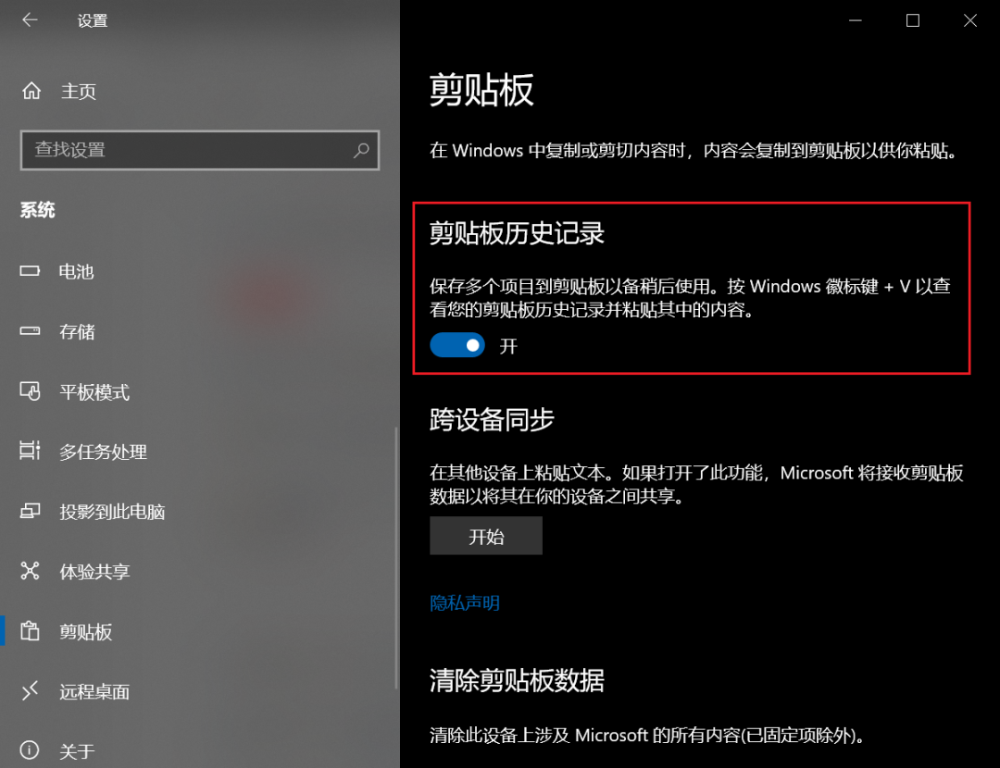
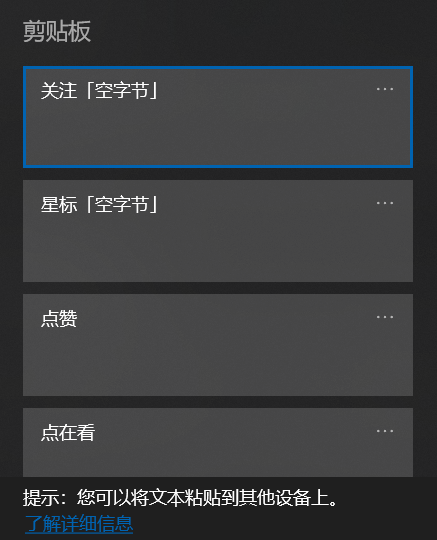
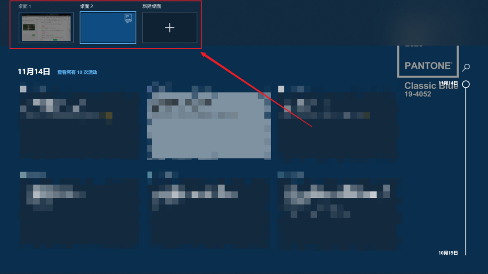
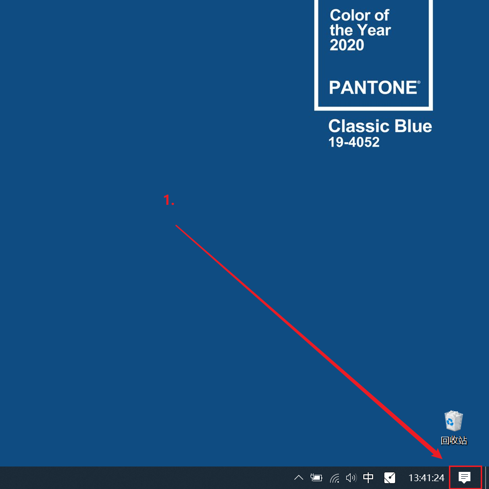
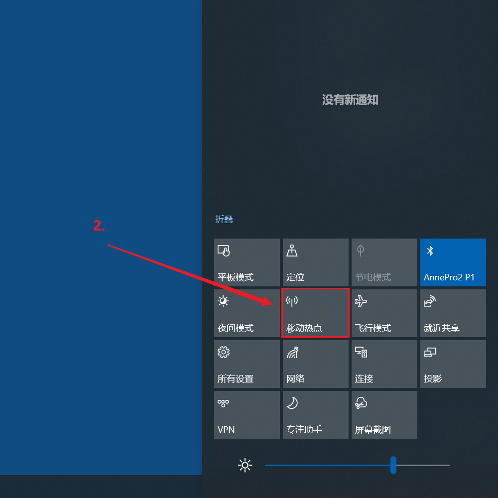

## 剪贴板

在 Windows 10 中，我们可以打开「剪贴板历史记录」，可以将多次复制的内容保留到剪贴板。

粘贴的时候，按下 Win + V，就可以选择要粘贴的内容了。

然后我们的操作路径就发生了如下的变化：

复制 切换 粘贴 复制 切换 粘贴 复制 切换 粘贴 👉 复制 复制 复制 切换 粘贴 粘贴 粘贴

与此同时，Windows 10 还提供了「云剪贴板」选项，开启同步之后就可以在多台设备上同步剪贴板了。

## 沙盒

沙盒其实就可以理解为一个虚拟机，使用沙盒就是在电脑里使用电脑。

所以即使你在沙盒里安装一些不太正经的软件然后导致死机了，你自己的电脑也不会受影响。

很多时候我们需要单独安装虚拟机，而 Windows 10 就自带了一个。

并且这个沙盒拥有桌面系统、文件系统，可以和真实电脑共享剪贴板数据，这表示你可以通过复制粘贴在真实电脑与沙盒之前传输数据。

温馨提示：沙盒只在 Windows 10 专业版中有。

## 虚拟桌面

虚拟桌面就是你可以同时创建多个桌面，方便多任务平行处理。

在 Windows 10 中，按下 Win + Tab 后，屏幕上方就会出现「新建桌面」的提示，点击即可创建新的桌面。

## 移动热点

这个功能应该还不太为人所知，或者很少有人使用。

其实就像手机热点一样，Windows 10 也可以开热点，将宽带网络通过热点供其他 WiFi 设备使用。

你只需要在「通知中心」中打开「移动热点」开关即可。

