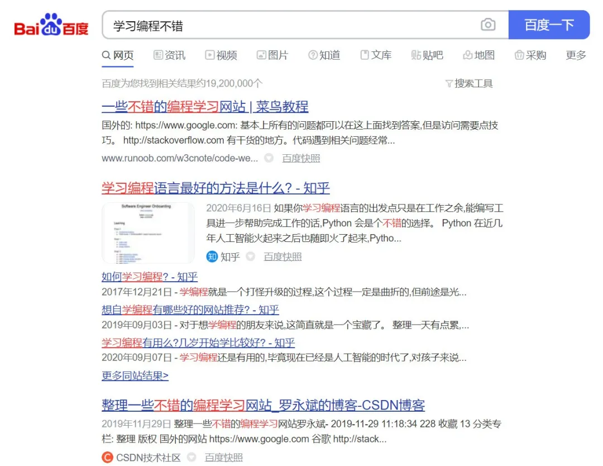
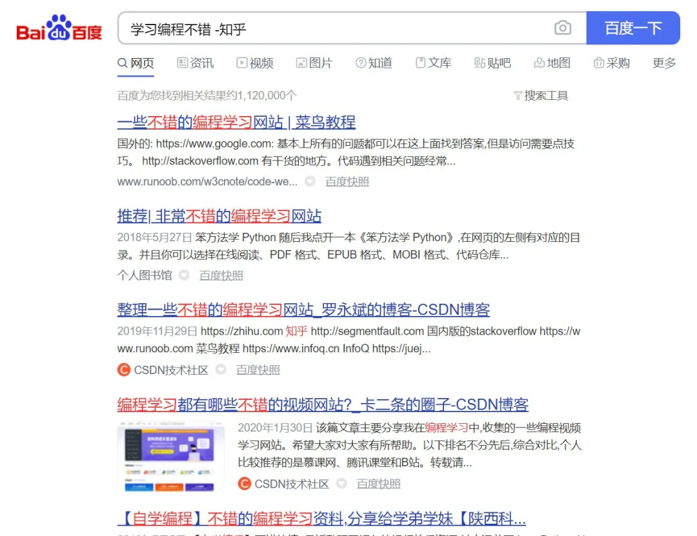
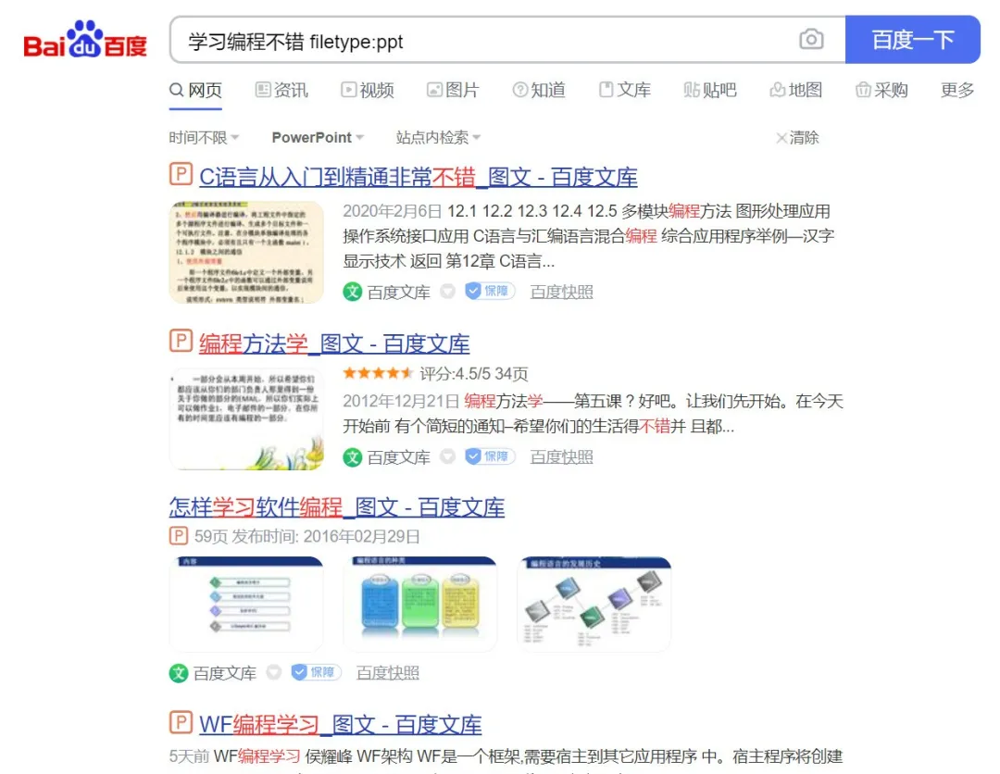
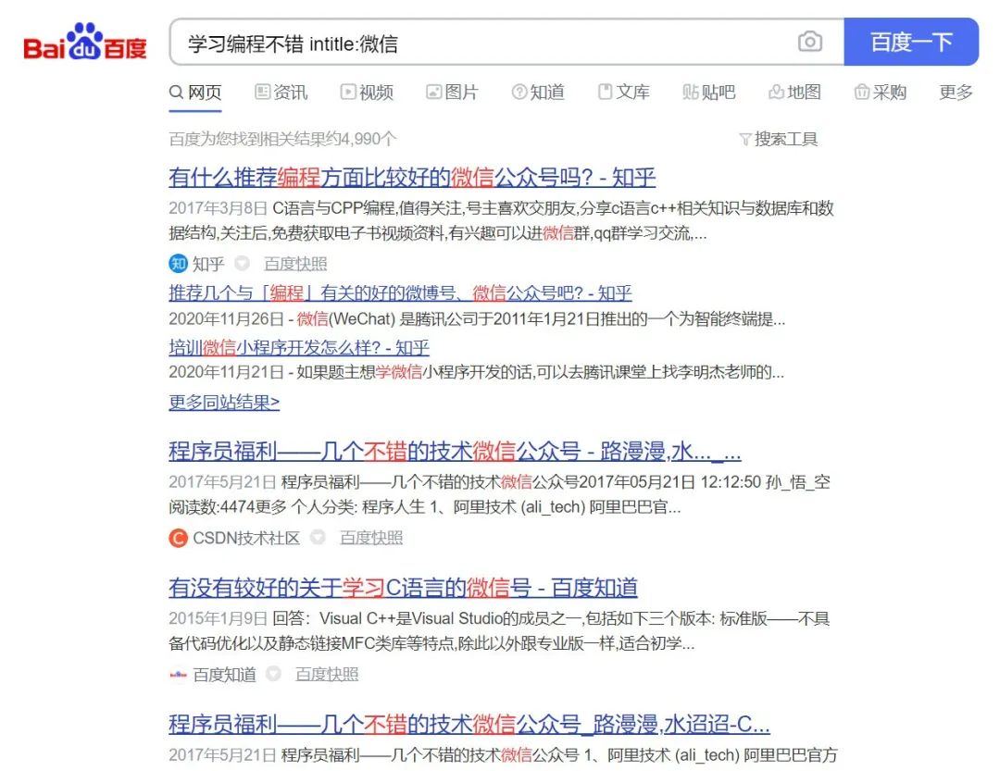
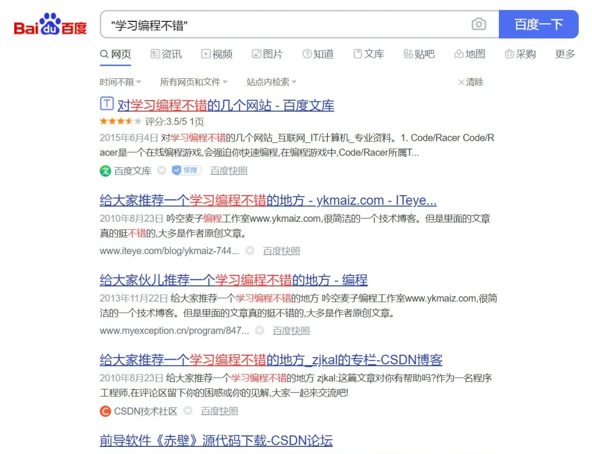

当我们搜索引擎搜索一个关键词的时候，搜索结果里总是参杂着很多垃圾信息。

今天我将分享一些高效的搜索方法来帮助更快地搜索到目标信息。

在开始之前，先来看看我用来对照的搜索结果：

## 过滤关键词

> 「关键词 A」+「空格」+「减号」+「关键词 B」

在一个关键词前加上减号，可以快速过滤包含该关键词的搜索结果，比如上式中的「关键词 B」。

搜索结果已经过滤了带有关键词「知乎」的内容。

## 在指定网站中搜索 

> 「关键词」+「空格」+「site:」+「网址」

在关键词后面加上一个 site:网址，可以在指定网址内搜索该关键词。

搜索结果只包含来自 bilibili.com 的内容。

注意：site: 后面的网址不要加上 http:// 或者 https://，只使用网站域名即可，否则将不能成功搜索。

## 搜索指定文件类型

> 「关键词」+「空格」+「filetype:」+「文件格式」

在关键词后面加上 filetype:文件格式，可以搜索指定文件格式的内容，比如 PPT、DOC、PDF 等等。

这个技巧真的很实用，可以快速查找资料。

## 限制标题关键词

> 「关键词 A」+「空格」+「intitle:」+「关键词 B」

搜索引擎在匹配关键词时会从网页的标题和正文内容中都进行匹配，我们可以指定网页标题一定带有某某关键词。

## 精准搜索

> 「"」+「关键词」+「"」

将关键词用引号括起来可以使搜索引擎精准匹配该关键词，搜索只会返回包含完整关键词的结果。

一个长的关键词并没有被拆分。

温馨提示：引号不用区分是否是中文引号或者英文引号。