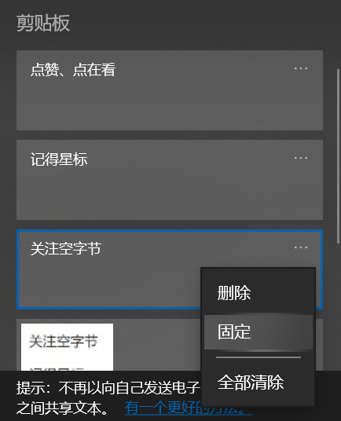
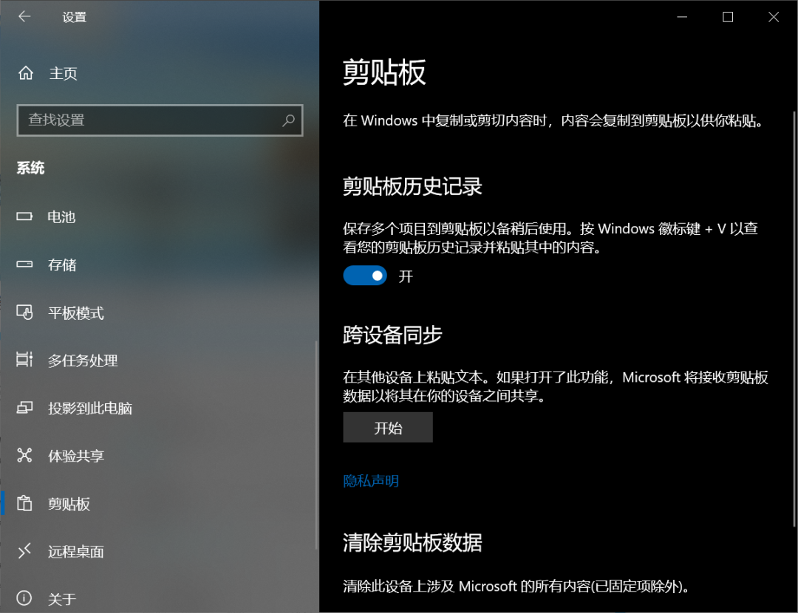
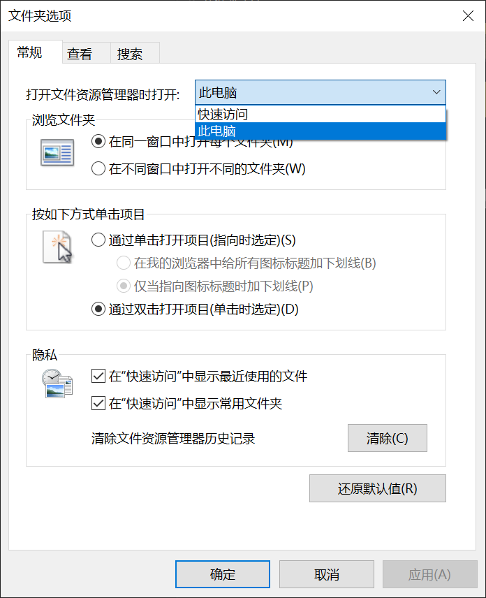
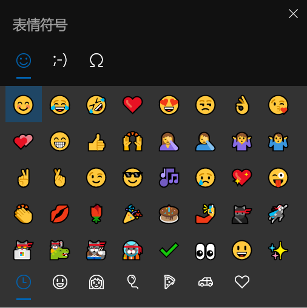
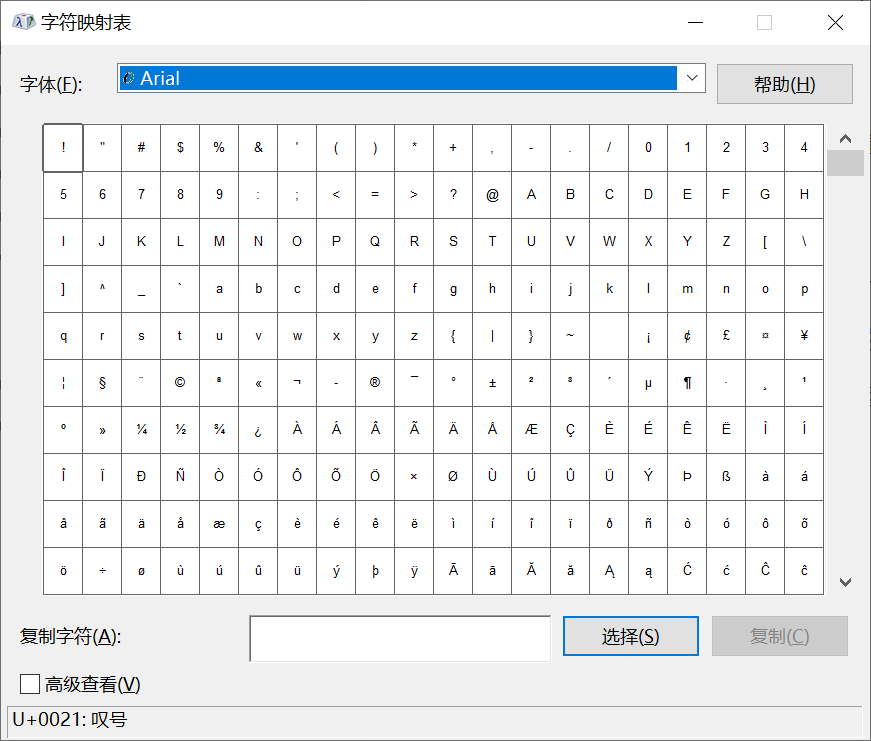

## Win + V

这个快捷键在我 [以前的分享](/p/windows-feature-tips) 里也有提到过，就是打开 Windows 自带的剪贴板。

通过剪贴板我们可以重复复制粘贴多条内容，并且同时支持文字与图片，也可以把需要经常使用的内容固定起来。

不过使用之前需要我们先开启剪贴板历史记录。

开启方法：设置 - 系统 - 剪贴板。

## Ctrl + Shift + T

你是否经常一不小心就把打开的网页全关了？然后只好通过历史记录一个一个重新打开。

如果你是这样的，那一定要记住这个快捷键：Ctrl + Shift + T。

温馨提示：在你关闭网页或者浏览器后，需要先打开浏览器然后再点击快捷键。

这样就可以直接恢复你刚刚关闭的网页。

## Win + E

不管你的电脑处于哪个页面，使用 Win + E 都可以快速打开文件资源管理器。

默认打开的是「此电脑」，但是你也可以设置打开「快速访问」。

设置方法：文件资源管理器 - 查看 - 选项 - 常规。

## Win + 数字

这是一个快速启动应用程序的快捷键，当你把常用的应用固定到任务栏后。

使用 Win + 对应的数字就可以快速启动该应用程序。

## Ctrl + A\S\Z\X\C\V

这几个快捷键是我每次写快捷键相关文章时必定会写的。

只要你使用电脑，一定要记住它们，几乎所有 PC 端应用程序都会使用这个逻辑。

| 快捷键 | 功能 |
| :-: | :-: |
| Ctrl + A | 全选 |
| Ctrl + S | 保存 |
| Ctrl + Z | 撤销 |
| Ctrl + X | 剪切 |
| Ctrl + C | 复制 |
| Ctrl + V | 粘贴 |

相信我，如果你不会这几个快捷键，你很可能会后悔。

## 特殊表情和符号

在 Windows 输入特殊表情和符号是一件很麻烦的事。

使用快捷键可以帮助你更加快速的完成这一任务。

「Win + 句号」可以快速打开表情符号。

「Win + R」然后输入「charmap」回车，可以快速打开特殊符号。

这个快捷键看起来并不快捷，但是真的很方便，没有这个需求的直接跳过吧！