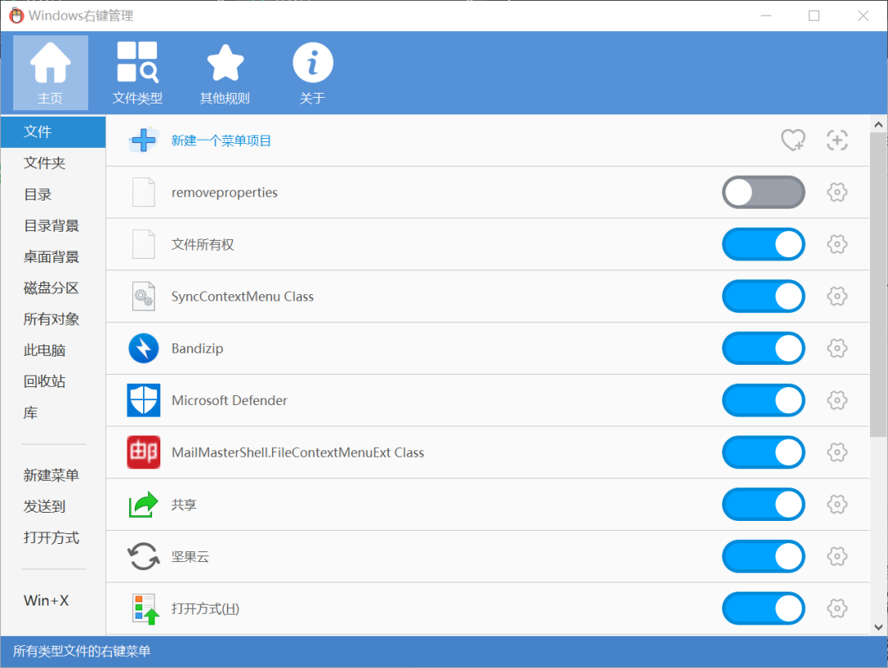

随着电脑越用越久，很多人可能不光 C 盘红了，甚至右键菜单选项都多得溢出了屏幕。

由于 Windows 一直没有右键菜单管理功能，所以很多人只能忍着，可能新建一个文档都得在繁多的菜单里寻寻觅觅好一会。

[Context Menu Manager](https://github.com/BluePointLilac/ContextMenuManager) 就是一个开源的 Windows 右键菜单管理器。

该软件还有几个特点：无广告、操作简单、体积小（317KB）、免安装。

打开软件我们可以看到功能真的非常丰富。

如果想要隐藏某一个右键菜单选项，直接把对应的开关关闭就可以了。

并且你还可以直接删除某个菜单选项，但是我并不推荐简单粗暴的删除。

实际上删除功能的加入是为了应付流氓软件的。

有时我们即使删除卸载了一款软件，但是右键菜单还会存在已被删除的软件功能选项。

这是因为这些软件在安装时往你的注册表里添加了一些垃圾，而卸载删除是不能清理干净的。

但是手动查找注册表并删除是很麻烦也有一定风险的事。

这时就可以通过 Context Menu Manager 一键删除。

最后，Context Menu Manager 还可以自定义菜单功能，但这就要求使用者了解一些 Windows 批处理的知识了，这里就不多介绍了。