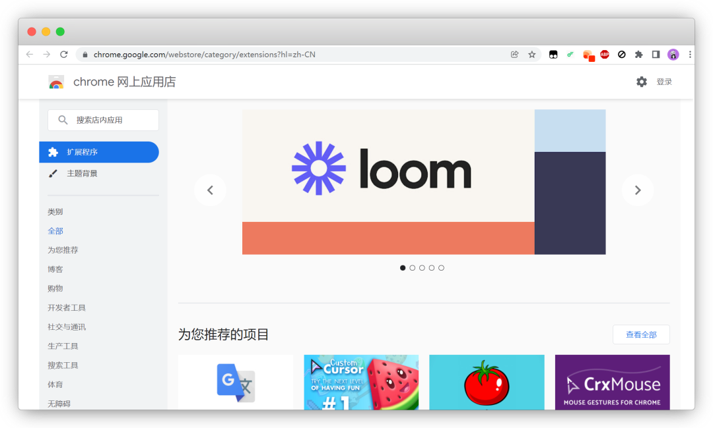
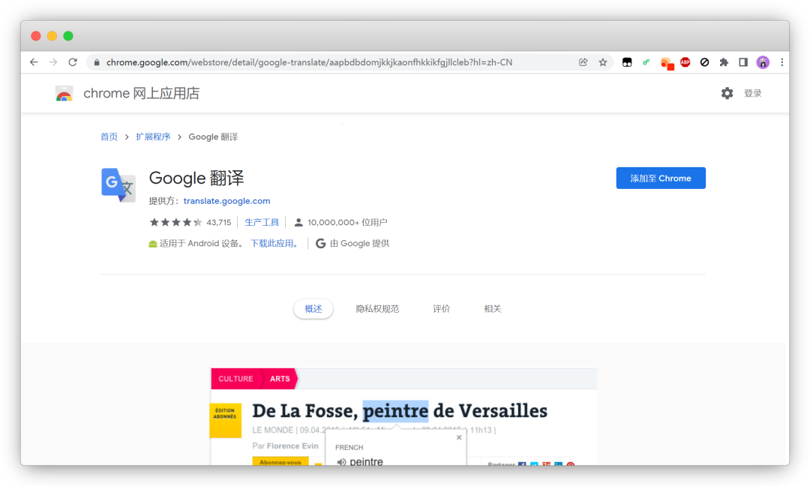
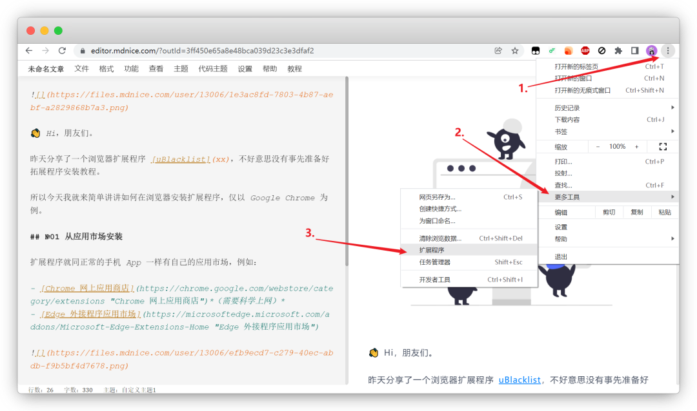
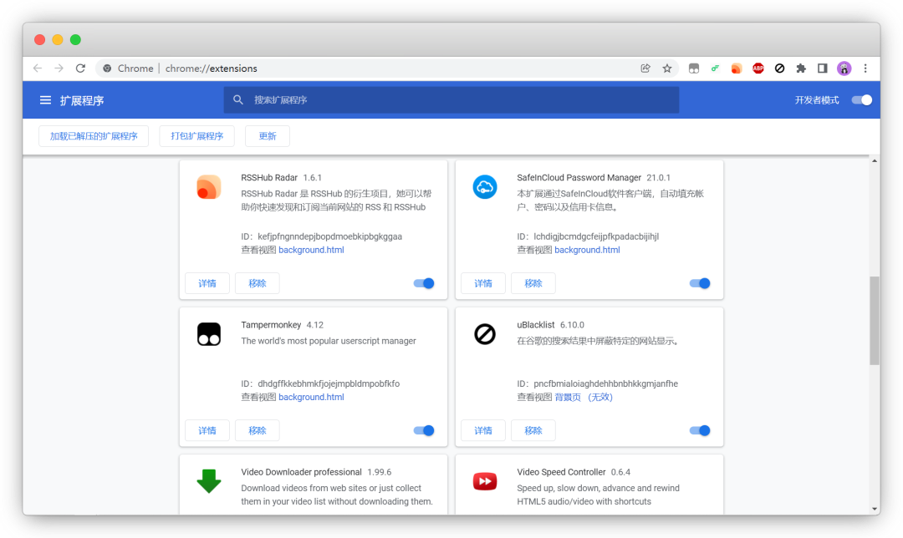
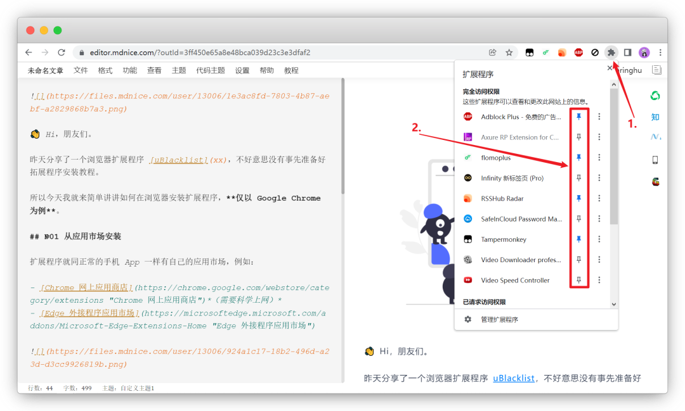

## 从应用市场安装

浏览器扩展程序就同正常的手机 App 一样有自己的应用市场，例如：

- [Chrome 网上应用商店](https://chrome.google.com/webstore/category/extensions)（需要科学上网）
- [Edge 外接程序应用市场](https://microsoftedge.microsoft.com/addons/Microsoft-Edge-Extensions-Home)

进入扩展应用市场找到自己想要安装使用的扩展程序之后，点击进入详情页面，然后点击「添加至 Chrome」即可。

## 从本地文件安装

为了解决有些用户无法访问 Chrome 网上应用商店的问题，网上有些人可能会直接提供 `.crx` 文件。

获取到 `.crx` 文件之后，我们在 Chrome 内点击最右上角的三个点「┇」，然后选择「更多工具」，点击「扩展程序」。

或者 Chrome 地址栏输入 `chrome://extensions/` 后点击回车即可进入扩展程序管理页面。

进入扩展程序管理页面之后，点击右上角开启「开发者模式」，然后将获取到的 `.crx` 文件直接拖入该页面即可完成安装。

## 显示/隐藏扩展程序图标

当我们安装好扩展程序之后，可能会发现刚刚安装的扩展程序图标并没有出现在 Chrome 右上角。

这时候只需要点击如图所示这个「扩展程序」图标，弹出的列表里面就是你已经安装好的扩展程序。

点击扩展程序后边的图钉符号即可选择是显示还是隐藏该扩展程序图标。