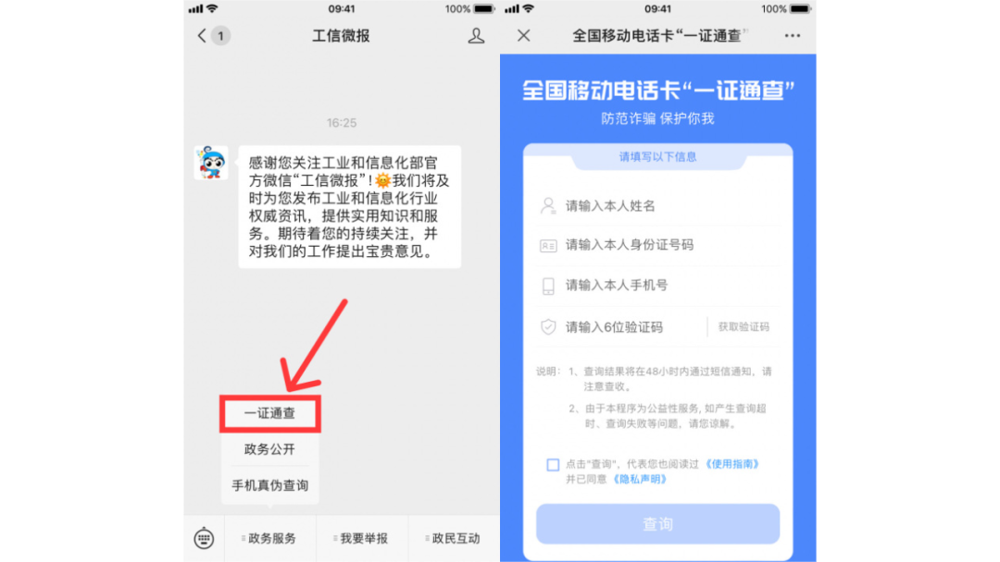
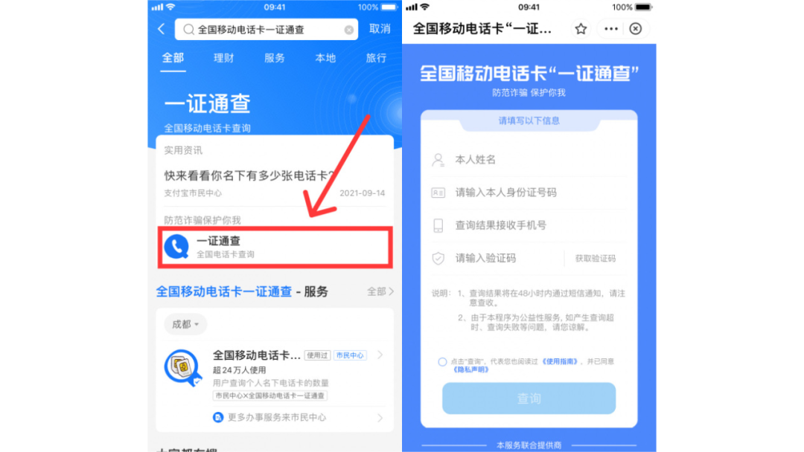
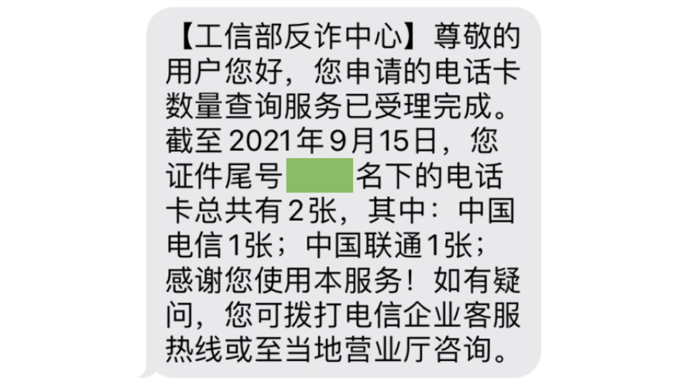

分享两种方式快速查询你的名下有几张电话卡：

1. 微信搜索「工信微报」公众号，关注后如图点击左下方「政务服务」，选择「一证通查」，进入查询页面后输入正确个人信息，点击「查询」按钮即可。

2. 支付宝搜索「全国移动电话卡一证通查」，如图点击「一证通查」，进入查询页面后输入正确个人信息，点击「查询」按钮即可。

温馨提示：短信验证码可能需要等 2 分钟左右才能接收到；点击「查询」按钮后不会立即出结果，结果会通过短信方式发送；同一身份证号 24 小时内只能提交一次查询。

除了以上方式，我们还可以拿上本人二代身份证到各个基础电信运营企业营业厅提交预约查询申请。

最后，如果你的查询结果与自己掌握的实际情况不一致，那你可以拨打相应电信企业客服电话进行咨询，然后按照其指引对不正常的电话卡进行核实、关停、销号等操作。