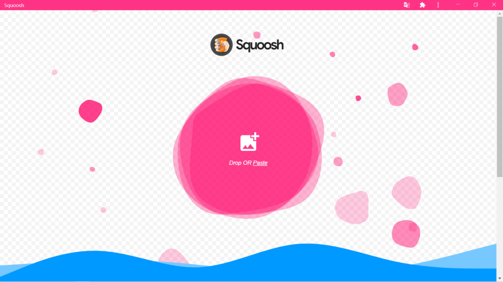
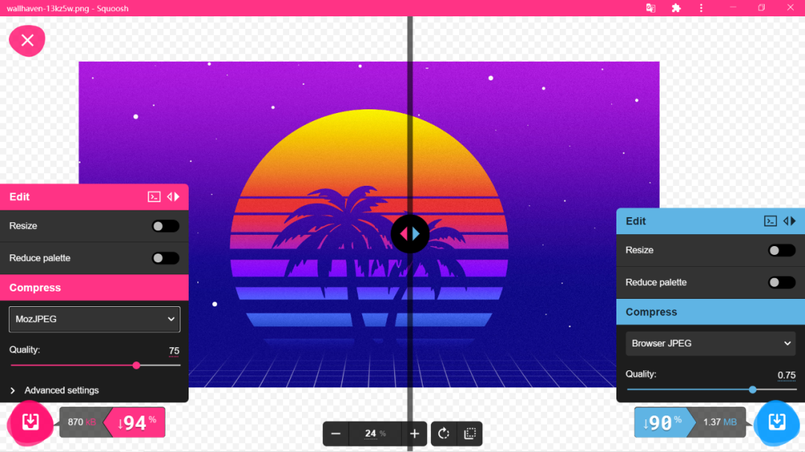

与众多图片压缩工具类似，[Squoosh](https://squoosh.app/) 也是一个在线工具，支持 JPG/PNG/SVG 等多种常见图片格式。

Squoosh 提供了多种图片压缩模式，同时支持直接对图片进行简单编辑。

打开 Squoosh 后上传需要压缩的图片，可以通过左右预览窗口配置不同的压缩参数，并且实时预览图片压缩后的画质、大小等参数。

Squoosh 的图片压缩能力非常强大，如下图测试，一张 13.2MB 的图片压缩为 870KB 后画质损失极小。

除此之外 Squoosh 还有一个非常神奇的点，当你第一次访问 Squoosh 网站之后，以后即使没有网络连接也可以通过访问该网站进行图片压缩操作（前提是没有清除缓存）。

并且 Squoosh 已经在 [GitHub](https://github.com/GoogleChromeLabs/squoosh) 开源，有能力的也可以自己部署图片压缩服务。